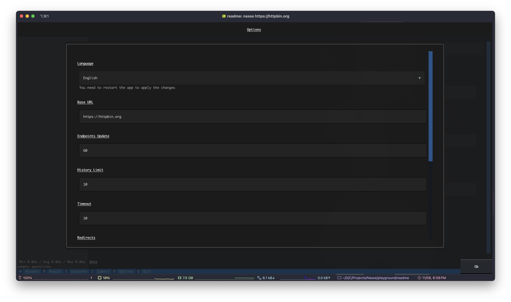

# `nasse`


A web server framework written on top of Flask which lets you focus on your ideas 🍡

***Actually spend time making your next app, we will do the annoying stuff for you!***

<br>
<br>

[](https://pypi.org/project/nasse/)
[](https://pepy.tech/project/nasse)
[](https://pypistats.org/packages/nasse)
[](https://pypi.org/project/nasse/)
[](https://pypi.org/project/nasse/)
[](https://github.com/Animenosekai/nasse/blob/master/LICENSE)
[](https://github.com/Animenosekai/nasse)
[](https://github.com/Animenosekai/nasse/actions/workflows/codeql-analysis.yml)


## Index

- [Index](#index)
- [Getting Started](#getting-started)
  - [Prerequisites](#prerequisites)
- [Installing](#installing)
  - [Option 1: From PyPI](#option-1-from-pypi)
  - [Option 2: From Git](#option-2-from-git)
- [Purpose](#purpose)
  - [Comparison](#comparison)
    - [Before](#before)
    - [After](#after)
- [Usage](#usage)
  - [Creating a new app](#creating-a-new-app)
  - [Flask integration](#flask-integration)
    - [Flask Configuration](#flask-configuration)
      - [Example](#example)
    - [In the routes](#in-the-routes)
      - [Example](#example-1)
  - [Registering new endpoints](#registering-new-endpoints)
  - [Documenting your endpoints](#documenting-your-endpoints)
  - [Documentation Values](#documentation-values)
    - [Return](#return)
    - [Login](#login)
    - [UserSent](#usersent)
    - [Error](#error)
  - [Context](#context)
  - [Returned Values](#returned-values)
  - [Error handling](#error-handling)
  - [JSON](#json)
  - [Utilities](#utilities)
    - [Logging](#logging)
    - [String Formatting](#string-formatting)
  - [Running the server](#running-the-server)
  - [Generate documentation](#generate-documentation)
    - [Localization](#localization)
  - [CLI](#cli)
    - [Runner](#runner)
    - [Docs](#docs)
    - [HTTP App](#http-app)
      - [Request](#request)
      - [Result](#result)
      - [History](#history)
      - [Explorer](#explorer)
      - [Options](#options)
      - [File browser](#file-browser)
- [Deployment](#deployment)
- [Contributing](#contributing)
- [Built With](#built-with)
- [Authors](#authors)
- [Acknowledgments](#acknowledgments)
- [License](#license)

## Getting Started

These instructions will get you a copy of the project up and running on your local machine for development and testing purposes. See deployment for notes on how to deploy the project on a live system.

### Prerequisites

You will need Python 3 to use this module

```bash
# vermin output
Minimum required versions: 3.8
Incompatible versions:     2
```

Always check if your Python version works with `Nasse` before using it in production.

## Installing

### Option 1: From PyPI

```bash
pip install --upgrade nasse
```

> This will install the latest stable version from PyPI

### Option 2: From Git

```bash
pip install --upgrade git+https://github.com/Animenosekai/nasse.git
```

> This will install the latest development version from the git repository

You can check if you successfully installed it by printing out its version:

```bash
$ nasse --version
2.0.2
```

## Purpose

This web server framework aims at bringing a new powerful tool to make your web application development easier.

It brings type safety, along with automatic documentation to force you write clean and safe code while avoiding unnecessary checks and data validation.

### Comparison

#### Before

```python
# my_project/api/v1/accounts.py

import json

from flask import Flask, request
from flask_compress import Compress
from flask_cors import CORS
from flask_talisman import Talisman

app = Flask(__name__)
Compress(app)
CORS(app)
Talisman(app)

# after a quick StackOverflow search
EMAIL_REGEX = re.compile(r'\b[A-Za-z0-9._%+-]+@[A-Za-z0-9.-]+\.[A-Z|a-z]{2,7}\b')

@app.route("/api/v1/accounts/profile", methods=["GET", "POST"])
def v1_accounts_profile():
    username = request.params.get("username", None)
    if not username:
        return 400, json.dumps({"error": "MISSING_ARG", "message": "The `username` argument is missing from the request"})
    password = request.params.get("password", None)
    if not password:
        return 400, json.dumps({"error": "MISSING_ARG", "message": "The `password` argument is missing from the request"})

    [...]
    # ...password validation and all...

    if str(request.method).upper() == "POST":
        email = request.params.get("email", None)
        if email and not EMAIL_REGEX.fullmatch(email):
            return 400, json.dumps({"error": "WRONG_EMAIL", "message": "The `email` argument doesn't seem to be a valid email address"})
        [...]
        return 200, json.dumps({"error": None, "message": "Account successfully created"})

    return 200, json.dumps({"error": None, "message": "Welcome back!"})
```

```markdown
<!-- my_project/docs/accounts.md -->

# Accounts

This file documents the correct way of using the accounts management endpoints for my project.

## v1/accounts

Here is an explanation...
```

#### After

```python
# my_project/api/v1/accounts.py

import re
from nasse import Nasse, Endpoint, Param, Login
from nasse.utils.types import Email, LimitedString

app = Nasse()

class Username(LimitedString):
    LIMIT = 200 # only allowing 200 characters

class Password(LimitedString):
    LIMIT = 100
    REGEX = re.compile(r"^(?=.*[a-z])(?=.*[A-Z])(?=.*\d)(?=.*[@$!%*?&])[A-Za-z\d@$!%*?&]{8,}$")
    THROW = True

ACCOUNTS_MANAGEMENT = Endpoint(category="Accounts Management", login=Login(required=True))

@app.route(Endpoint(
    endpoint=ACCOUNTS_MANAGEMENT, # this will take ACCOUNTS_MANAGEMENT as the base
    methods=["GET", "POST"],
    login=Login(no_login=True),
    params=[
        Param("username", {
            "GET": "The username of the user to check the authentication",
            "POST": "A new username"
        }, type=Username),
        Param("email", "The user's email address", methods="POST", required=False, type=Email),
        Param("password", "The user's password", type=Password),
    ]
))
def profile(method: str, username: str, password: str, email: str = None): # all of this comes from the request params and are type safe/validated
    if method == "POST":
        return 200, "Account created successfully"
    return 200, "Welcome back"

# This will actually generate all of the docs for you !
app.make_docs()
app.run()
```

> **Note**  
> Tip: You can also use `nasse my_project/api/v1/accounts.py` to run without calling `app.run()`!

But it could even look like this:

```python
# my_project/api/v1/accounts.py

import re
from nasse import Nasse, Endpoint, Login
from nasse.utils.types import Email, LimitedString

app = Nasse()

class Username(LimitedString):
    LIMIT = 200 # only allowing 200 characters

class Password(LimitedString):
    LIMIT = 100
    REGEX = re.compile(r"^(?=.*[a-z])(?=.*[A-Z])(?=.*\d)(?=.*[@$!%*?&])[A-Za-z\d@$!%*?&]{8,}$")
    THROW = True

@app.route(category="Accounts Management", methods=["GET", "POST"], login=Login(no_login=True))
def profile(method: str, username: Username, password: Password, email: Email = None):
    if method == "POST":
        return 200, "Account created successfully"
    return 200, "Welcome back"

app.make_docs()
app.run()
```

## Usage

### Creating a new app

Creating a new app is dead simple.

Just import the Nasse object and create a new instance of it

```python
>>> from nasse import Nasse
>>> app = Nasse()
```

This is the bare minimum, but you should of course configure it.

You should at least give it a name and configure the CORS domains.

```python
>>> app = Nasse("My App", cors="https://myapp.com")
```

Lots of things will be initialized with their default configuration.

If you want to customize them, you might want to take a look at the `nasse.config.NasseConfig` object, which has all the Nasse configuration.

> **Note**  
> Some strings support the [Nasse string formatting](#string-formatting).
> For example: `NasseConfig.server_header` supports it, and the default value is : `nasse/{version} ({name})`. The `{version}` and `{name}` parts will be filled automatically.

The `account_management` parameter should be of instance `models.AccountManagement` and is used to manage the users authentications.

> Example

```python
>>> from yuno.security.token import TokenManagement
>>> from account_management import get_account_by_id
>>> from nasse.models import AccountManagement
>>> tm = TokenManagement()
>>> class NewAccountManagement(AccountManagement):
...     def retrieve_type(self, account):
...         return "admin" if account.id == "123abc" else "user"
...     def retrieve_account(self, token: str):
...         return get_account_by_id(tm.decode(token))
...     def verify_token(self, token: str):
...         try:
...             tm.decode(token)
...             return True
...         except Exception:
...             return False
...
>>> app = Nasse(account_management=NewAccountManagement())
```

You can also specify specific Flask parameters using the `flask_options` parameter if needed.

### Flask integration

Nasse being built on top of Flask, it is fully compatible with its ecosystem.

As said before, lots of Flask settings are available and exposed to you.

#### Flask Configuration

You can configure the Flask app using the `flask_options` parameter when instantiating a new Nasse instance.

But you can also use the `Nasse.flask` attribute, which exposes the underlying Flask app to use your favorite plugins !

##### Example

If for whatever reason you need to add a Flask plugin :

```python
from nasse import Nasse
from flask_cool_plugin_yay import CoolPlugin

app = Nasse()
CoolPlugin(app.flask)
```

or if a service expect a flask app, you can trick it to expose the Flask app :

```python
from nasse import Nasse

nasse_app = Nasse()
app = nasse_app.flask # this is the Flask app
```

#### In the routes

Most of your Flask compatible code should probably already be compatible with Nasse.

For example, the `route` and `methods` parts of the `app.route` function work the same way as Flask.

##### Example

With ***Flask***

This is a very basic way of using Flask.

```python
from flask import Flask, request
app = Flask(__name__)

@app.route("/hello", methods=["GET", "POST"])
def hello():
    return 200, "Hello {}".format(request.params.get("name", "world"))
```

With ***Nasse***

Well this already works with Nasse !

```python
from nasse import Nasse, request
app = Nasse(__name__)

@app.route("/hello", methods=["GET", "POST"])
def hello():
    return 200, "Hello {}".format(request.params.get("name", "world"))
```

But can also be changed like this :

```python
from nasse import Nasse, Param
app = Nasse()

@app.route(methods=["GET", "POST"], params=Param("name", required=False))
def hello(name: str = "World"):
    return 200, "Hello {}".format(name)
```

### Registering new endpoints

You can register new endpoints using the `route` decorator, just like Flask!

```python
>>> @app.route("/hello")
>>> def hello():
...     return "Hello World!"
```

But did you know that this worked too?

```python
>>> @app.route()
>>> def hello():
...     return "Hello World!"
```

Where's the `"/hello"` part?

> If you don't specify it, it will be automatically generated from the function name.

You can follow a specific syntax for your functions name to create rich routes:

- To create a hyphen "-", use an upper case letter, kinda like when you use *camelCase*.

> `def myRoute()` ⇒ /my-route

- To create a new slash "/", use an underscore "_".

> `def my_route()` ⇒ /my/route

- To create a new dynamic parameter, use a double underscore "__".

> `def my__route__(route)` ⇒ /my/\<route>/

- You can mix everything up as you wish.

> `def my_helloWorld_route__name__(name)` ⇒ /my/hello-world/route/\<name>/

Also, the directory the function is in will be used to determine the route, this behavior can be changed with the `base_dir` parameter of the endpoint.

You can then use parameters to configure and document the endpoint.

### Documenting your endpoints

You can configure the endpoint by passing it a `nasse.models.Endpoint` instance.

Everything is meant to be reusable to write less and more readable code.

For example, you could define a basic and global endpoint configuration for all your endpoints at the top level.

Then configure a general endpoint configuration for the endpoint file.

And then make specific tweaking for each endpoint.

To inherit the configuration from another endpoint, you just need to pass the endpoint to the `endpoint` parameter of the new `Endpoint`.

```python
>>> from nasse.models import Endpoint
>>> from config import BASE_ENDPOINT
>>> from account_management import all_accounts
>>> ACCOUNT_ENDPOINTS = Endpoint(
    endpoint=BASE_ENDPOINT,
    category="Account Management",
)
>>> @app.route("/accounts", endpoint=Endpoint(
    endpoint=ACCOUNT_ENDPOINTS,
    name="Accounts",
    description="Get all of the accounts"
))
>>> def accounts():
...     return all_accounts()
```

But did you know that defining your functions the right way (giving a good name, type-hinting them and adding *doc-strings*) would already give Nasse enough information to build a nicely documented endpoint.

For example

```python
>>> from nasse import Parameter
>>> @app.route(
        path="/accounts",
        name="accounts_endpoint",
        category="test",
        parameters=[Parameter("username"), Parameter("limit", type=int, required=False)],
        description="This returns all accounts"
    )
... def accounts_endpoint(username: str, limit=100):
...     return get_accounts(username)
```

Could be rewritten as:

```python
>>> @app.route
... def accounts(username: str, limit: int = 100):
...     """This returns all accounts"""
...     return get_accounts()
```

This is the most natural way of writing your endpoints, almost as if your function never leaved Python.

And by using the [`miko`](https://github.com/Animenosekai/miko) documentation style, you can even add descriptions to your parameters:

```python
>>> @app.route
... def accounts(username: str, limit: int = 100):
...     """
...     This returns all accounts
...
...     Parameters
...     ----------
...     limit: int
...         An upper boundary for the number of accounts to return
...     """
...     return get_accounts()
```

> **Note**  
> The name of the endpoint will be the name of the function and its category will be the name of the file you defined the function in.
>
> We understand that it is not required to list all parameters in the doc-string.

Note that Nasse will automatically detect the different dynamic parts of the path:

```python
>>> @app.route
... def hello__someone__(someone: str):
...     return f"Hello {someone}"
...
>>> @app.route
... def repeat__msg__(msg: str, number: int = 10):
...     """
...     Repeats the given element `number` times
...     
...     Parameters
...     ----------
...     msg: str
...         The element to repeat
...     number
...         The number of times to repeat it
...     """
...     return [msg] * number
```

You can also specify the return value from within the function definition:

```python
>>> from nasse import Nasse, Response, Return
>>> app = Nasse()
>>>
>>> # Basic example
>>> @app.route
... def hello(username: str = "someone") -> Response[Return("hello", example="someone")]:
... """A hello world"""
... return Response({"hello": username})
...
>>> # A bit more complex
>>> @app.route
... def hello(method: str, username: str = "someone") -> Response[{"GET": Return("hello"), "POST": Return("hi")}]:
... """A hello world"""
... if method == "POST":
...     return Response({"hi": username})
... return Response({"hello": username})
```

You can then use the same syntax as when documenting `returning` in the `Endpoint` class.

Refer to [Return](#return) for the `Return` class explanation.

> **Note**  
> Type checkers won't complain because of the use of `Response`, which technically your function returns.

It is very important to rightfully document your endpoints because it will be used to process the requests and validate the inputs.

### Documentation Values

#### Return

The `models.Return` model is used to document what the endpoint returns.

Here are its parameters:

- `name`: The name of the field
- `example`: An example of returned value
- `description`: A description of the returned value
- `type`: The type of returned value
- `children`: The different children values
- `nullable`: If this value is can be `null` (`None`)

#### Login

The `models.Login` model is used to document how a user can authenticate its request with this endpoint.

Here are its parameters:

- `required`: If the login is required or not. The user may still authenticate.
- `types`: Accepted types of accounts
- `skip`: Whether to completely skip or not the authentication step
- `skip_fetch`: Whether to skip fetching the account or not. This effectively only checks if the provided token is correct or not.

#### UserSent

The `models.UserSent` model is used to document what the user can send to the endpoint.

Here are its parameters:

- `name`: The name of the value sent
- `description`: A description of the value sent
- `required`: If the value is required or not
- `type`: The type of value sent by the user

> **Note**  
> `models.Dynamic`, `models.Parameter`, `models.Header` and `models.Cookie` are all aliases of `models.UserSent`

#### Error

The `models.Error` model is used to document what errors can be returned by the endpoint.

Here are its parameters:

- `name`: The name of the error
- `description`: A description of a situation where this error might be raised
- `code`: The status code of the response sent along this error

### Context

The context values will be of the type you provided in the endpoint definition.

There are multiple ways you can access a request context.

You can import the `request` global variable from `nasse`

```python
>>> from nasse import request
>>> request.values
```

But a better way would be to directly ask for it inside your endpoint function parameter.

You can ask whatever you want from there.

```python
>>> @app.route()
>>> def hello(request): # this will ask Nasse for the `request` object
...     return request.values
```

```python
>>> @app.route
>>> def hello(headers): # this will ask Nasse for the request `headers`
...     return headers
```

Here is a list of parameters you can ask for:

- `app`: The current Nasse app instance
- `endpoint`: The current Nasse endpoint
- `request`: The current request context
- `method`: The HTTP method of the request
- `values`: The URL/form values of the request
- `args`: The URL arguments of the request
- `form`: The form values of the request
- `headers`: The headers of the request
- `account`: The authenticated account for the request
- `dynamics`: The dynamic route parameters of the request

***And their aliases***

- `nasse`: An alias for `app`
- `nasse_endpoint`: An alias for `endpoint`
- `params`: An alias for `values`

Any other requested parameter will be either a **dynamic route parameter** or a **URL/form parameter**.

> **Note**  
> Those request parameters can also be used to document your endpoints, please look at the [Documenting your endpoints](#documenting-your-endpoints) section for more information.

### Returned Values

You can return any kind of value from your endpoint function.

There are multiple ways to return values:

- Using the `response.Response` class

```python
... return Response(
    data=data,
    code=200,
    headers={
        "X-ANISE-CACHE": "HIT"
    },
    ...
)
```

- Using only the data

```python
... return "Hello World"
# or
... return binary_data # of instance `bytes`
```

- Using a dictionary

The dictionary will be automatically passed to `response.Response`

```python
... return {
    "data": data,
    "code": 200,
    "headers": {
        "X-ANISE-CACHE": "HIT"
    },
    ...
}
```

If the dictionary can't be passed to `response.Response`, it will be treated as part of the `data` to send back.

```python
... return {"greeting": "Hello World"}
```

- Using an iterable, like a tuple

```python
... return 200, "Hello World"
# or
... return ("Hello World", 200)
```

> **Note**  
> On debug mode, a set of timing header headers will automatically be returned.

### Error handling

Even if your application encounters an error/exception, it will be automatically caught by Nasse and correctly formatted to be safely returned to the client.

> **Note**  
> Tip: You should use the `nasse.exceptions.NasseException` class to create your own exceptions.
> This way, you will be able to fully customize the error response.

But even with regular `Exception` exceptions, Nasse will attempt to generate an error name and a description without leaking too much information.

### JSON

If the endpoint is configured as a JSON endpoint, it will be formatted using the following schema, and will have some features added.

```json
{
    "success": true,
    "error": null,
    "message": "",
    "data": {}
}
```

Nasse uses a custom JSON encoder to fully customize it and avoiding bugs.

> **Note**  
> Also, on debug mode, the response will have an additional `debug` field containing the debug information.
>
> **Note**  
> If the `format` parameter is set to `xml` or `html` when making the request, the response will be automatically converted to an *XML* format.
> Example: `/hello?format=xml` will produce a `XML` formatted output.

### Utilities

Nasse is shipped with a set of utilities that you can use inside your application.

They are mostly located inside the `utils` module.

#### Logging

You should use Nasse's logging system to log stuff on your console to avoid any issue with `rich`.

You can access the logging instance as a global variable :

```python
from nasse.utils.logging import logger

logger.log("Hello")
logger.debug("Hello")
logger.warn("Hello")
...
```

Or use the one on your Nasse instance :

```python
from nasse import Nasse

app = Nasse()
app.log("Hello")
app.logger.info("Hello")
app.logger.error("Hello")
```

You can actually decide to only include the message to the log file and not print it on the console by using the `HIDDEN` logging level :

```python
logger.hidden("Hello") # this will add the hello message to the log file but not STDOUT
```

The logger supports [Nasse's string formatting](#string-formatting).

#### String Formatting

String formatting is a way of making template strings which will dynamically change its value with variables.

In python, the `format` function allows strings to use variables to create strings :

```python
name = "world"

# are all equivalent
"Hello {}".format(name)
"Hello {name}".format(name=name)
f"Hello {name}"
```

With Nasse, you can use this string formatting syntax, but with default values which can be automatically filled :

```python
from nasse.utils import formatter

formatter.format("Hello {name} from process {pid}", name="world")
```

Most of the time, this is used when logging stuff to the console :

```python
logger.print("Hello {user} from process {pid}", user="world")
```

<!-- markdownlint-disable MD033 -->
<details>
    <summary>Here is a list of default variables you can use with Nasse's string formatting</summary>
    <li>normal</li>
    <li>grey</li>
    <li>gray</li>
    <li>red</li>
    <li>green</li>
    <li>blue</li>
    <li>cyan</li>
    <li>turquoise</li>
    <li>white</li>
    <li>yellow</li>
    <li>purple</li>
    <li>pink</li>
    <li>magenta</li>
    <li>name</li>
    <li>app</li>
    <li>id</li>
    <li>host</li>
    <li>port</li>
    <li>debug</li>
    <li>version</li>
    <li>base_dir</li>
    <li>time</li>
    <li>caller</li>
    <li>thread</li>
    <li>pid</li>
    <li>cwd</li>
</details>
<!-- markdownlint-enable MD033 -->

### Running the server

Running the server is as easy as calling

```python
app.run()
```

> **Note**  
> You can also use the terminal to directly run the server. Head over to [Runner](#runner) for further information.

Where `app` is your Nasse instance.

You can specify the backend you want to use to run the server using one of the already defined `nasse.servers...` objects are a custom-made one, following the `nasse.servers.ServerBackend` class.

You can here specify the host and port to run the server on.

If not specified, the host and port `127.0.0.1:5005` will be used.

On debug mode, Nasse will reload on any file change.

> **Note**  
> Tip: You can use the `include` and `exclude` parameters to specify which files to watch for.

### Generate documentation

With the data you provided to the endpoints, Nasse is able to generate markdown and postman documentation for you.

Use the `make_docs` method inside your application to generate the documentation.

```python
>>> app.make_docs()
```

> **Note**  
> You can also use the terminal to generate the docs. Head over to [Docs](#docs) for further information.

It will generate the examples, usage and explanation for each endpoint, along with an index of the endpoints and a general explanation at the top.

The Postman documentation is a set of JSON files, one for each category, that you can import inside Postman to test your API.

It will create a `docs` directory in the current directory to put both documentations.

#### Localization

You can now use the docs' localization feature which lets you use a different language for your docs !

```python
from nasse import Nasse
from nasse.localization import JapaneseLocalization

app = Nasse()
app.make_docs("./docs/jpa", localization=JapaneseLocalization, javascript=False)
```

Here are the built-in languages :

- English
- French
- Japanese

But you can create your own translation by sub-classing `nasse.localization.Localization`

### CLI

#### Runner

You can directly run your Nasse apps using the CLI.

To do so, head over to your terminal and enter:

```bash
nasse <your_app.py>
```

This should run the app with the default parameters.

If you want to customize the running behaviors, you can use the arguments with a `(server)` note prepended to their explanation when you run the `--help` command:

```bash
$ nasse --help
usage: nasse [-h] [--version] [--host HOST] [--port PORT] [--server SERVER] [--watch [WATCH ...]] [--ignore [IGNORE ...]] [--debug] [--config CONFIG]
             [input]

A web server framework written on top of Flask which lets you focus on your ideas 🍡

positional arguments:
  input                 The file or URL to use with nasse

options:
  -h, --help            show this help message and exit
  --version, -v         show program's version number and exit
  --host HOST           (server) The host to bind to
  --port PORT, -p PORT  (server) The port to bind to
  --server SERVER, -s SERVER
                        (server) The server to use (accepts: flask, gunicorn)
  --watch [WATCH ...], -w [WATCH ...]
                        (server) Files to watch changes on debug mode
  --ignore [IGNORE ...], -i [IGNORE ...]
                        (server) Files to ignore when watching for file changes on debug mode
  --debug, -d           (server) To run with debug mode enabled
  --config CONFIG, -c CONFIG
                        (server) A configuration file for extra arguments passed to the server
```

The `--config` argument takes in a JSON file containing the different configurations you would like to pass in to the `run` function of your `Nasse` instance.

#### Docs

You can use the CLI to directly generate the docs:

```bash
nasse --make-docs <your_app>.py
```

You can also customize the docs' generation using arguments:

```bash
$ nasse --help
usage: nasse [-h] [--version] [--make-docs] [--language LANGUAGE]
             [--output OUTPUT] [--docs-curl] [--docs-javascript] [--docs-python]
             [input]

A web server framework written on top of Flask which lets you focus on your ideas 🍡

positional arguments:
  input                 The file or URL to use with nasse

options:
  -h, --help            show this help message and exit
  --version, -v         show program's version number and exit
  --make-docs, -md, --docs, --generate-docs
                        (docs) Generates the docs and exits
  --language LANGUAGE, --localization LANGUAGE
                        (docs) The docs language
  --output OUTPUT, -o OUTPUT, --docs-dir OUTPUT, --docs_dir OUTPUT
                        (docs) The directory to output the docs
  --docs-curl           (docs) If we need to render the curl examples
  --docs-javascript     (docs) If we need to render the javascript examples
  --docs-python         (docs) If we need to render the python examples
```

Here are the languages you can use to generate the docs:

- [`eng`](https://github.com/Animenosekai/nasse/blob/main/nasse/localization/base.py) (default)
- [`fra`](https://github.com/Animenosekai/nasse/blob/main/nasse/localization/fra.py)
- [`jpn`](https://github.com/Animenosekai/nasse/blob/main/nasse/localization/jpn.py)

> **Note**  
> Those codes are the name of the file the `Localization` object was created in

#### HTTP App

You can also use the built-in HTTP app to test your endpoints.

This app might be familiar to those using the Postman software.

To open it, just enter

```bash
nasse
```

This should open the app, and you should land on this page:


##### Request

The `Request` tab is the main tab to prepare your requests.

The first two inputs lets you choose the HTTP method to use and the URL to submit the requests to.

The inputted URL can be an absolute URL or a relative path. In the latter case, the URL provided when launching the app or the one inputted in the [`Options`](#options) tab will be used to complete it.


##### Result

When you submit a request, by pressing `S` or clicking the `Submit` button on the footer, the `Result` tab should open automatically.

Click on it to expand it.


You can here see the details of your request, or the details of the error if the request errored out.


##### History

The history tab keeps a history of your requests.

You can click on any request to see its details in the [`Result`](#result) tab.

The bottom part of the history tab shows a graph with the time it took to make each request.


##### Explorer

The explorer can be used when you are testing a `Nasse` server in `DEBUG MODE` (`--debug` enabled)

If I go into [*playground/readme*](playground/readme/) and I run the server:

```bash
🧃❯ python run.py --debug
2023/08/11, 18:55:59 | [WARNING] (yay) DEBUG MODE IS ENABLED
2023/08/11, 18:55:59 | [INFO] (yay) 🎏 Press Ctrl+C to quit
2023/08/11, 18:55:59 | [INFO] (yay) 🌍 Binding to 127.0.0.1:5005
🍡 yay is running on http://127.0.0.1:5005 — 0:00:04
```

I can then run the HTTP app:

```bash
nasse http://127.0.0.1:5005
```

And will see the different endpoints in the explorer:


##### Options

The options screen will let you easily configure the app:



All the modifications will be stored in the current directory and be restored on the next launch.

##### File browser

The file browser is used throughout the app whenever it needs a file input.

You can filter the different files and folders by starting to type your keyword.


You can then navigate using the arrows on your keyboard and select your file by pressing `ENTER`.

## Deployment

This module is currently in development and might contain bugs.

Please verify and test your endpoints thoroughly before releasing anything at a production stage.

Feel free to report any issue you might encounter on Nasse's GitHub page.

## Contributing

Pull requests are welcome. For major changes, please open a discussion first to discuss what you would like to change.

<!-- Please make sure to update the tests accordingly. -->

## Built With

- [Flask](https://github.com/pallets/flask) - Nasse is built on top of flask to provide the interface
- [watchdog](https://github.com/gorakhargosh/watchdog) - To watch for file changes
- [Werkzeug](https://github.com/pallets/werkzeug/) - Flask's core
- [bleach](https://github.com/mozilla/bleach) - To sanitize inputs
- [rich](https://github.com/Textualize/rich) - To provide good-looking console outputs
- [textual](https://github.com/Textualize/textual) - To build the HTTP TUI
- [Flask-Compress](https://github.com/colour-science/flask-compress) - To compress the responses

## Authors

- **Animenosekai** - *Initial work* - [Animenosekai](https://github.com/Animenosekai)

## Acknowledgments

Thanks to *CherryPieWithPoison* for the Statue of the Seven model.
> [© 2021 - 2022 CherryPieWithPoison](https://www.deviantart.com/cherrypiewithpoison/art/MMD-Genshin-Impact-Statues-of-the-Seven-DL-871695397)

The Dictionary to XML conversion is heavily inspired by dict2xml by delfick.
> Licensed under the MIT License. More information in the header of the [xml.py](./nasse/utils/xml.py) file.

## License

This project is licensed under the MIT License - see the [LICENSE](./LICENSE) file for more details
